# Crimson Glass screenshot gallery

A component tour of the black/red KDE Plasma theme. Click any image to open its full size.

These are existing captures from the September/October 2026 theme build, with detail crops and personal labels covered where noted. Boot layouts and the icon sheet are rendered previews. Still images do not demonstrate animation. The current release replaces the earlier Mac-style icon pack.

## Desktop and wallpaper

Desktop capture from the theme build; panels and dock are outside this frame.

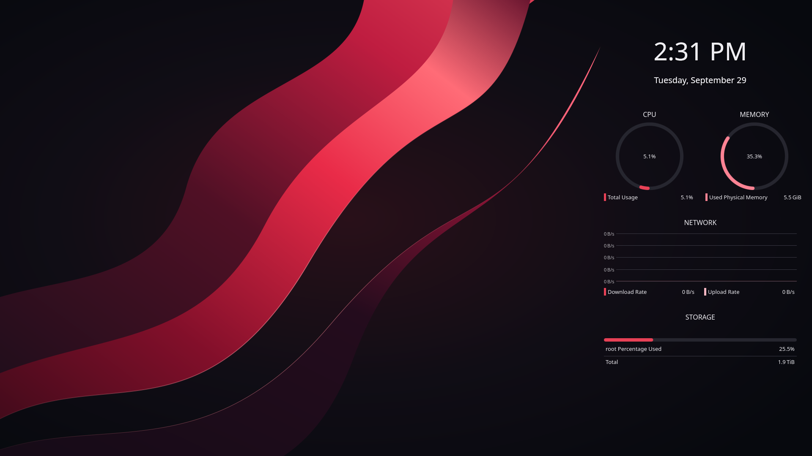

## System monitoring widgets

Clock, CPU, memory, network, and storage widgets; detail crop from the desktop capture.

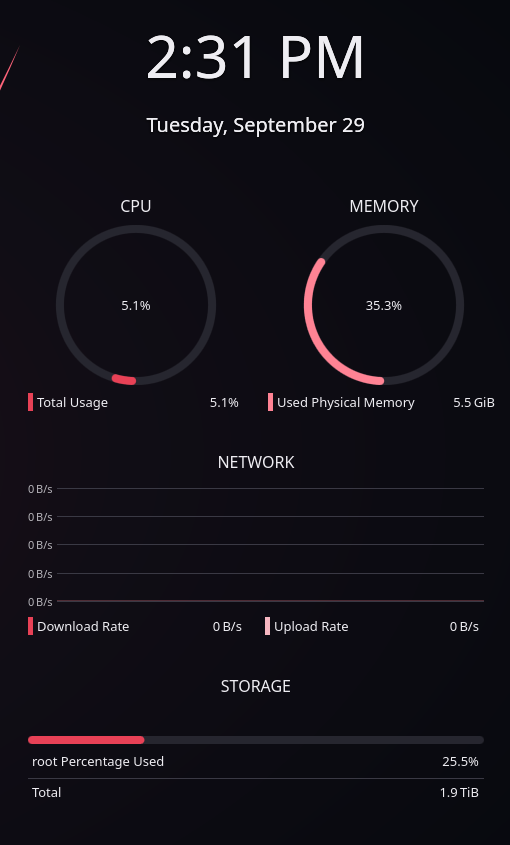

## Dolphin with the complete icon pack

Actual Dolphin capture with red folders, matching Places icons, and glass styling. Personal device labels and the home-folder name are covered.

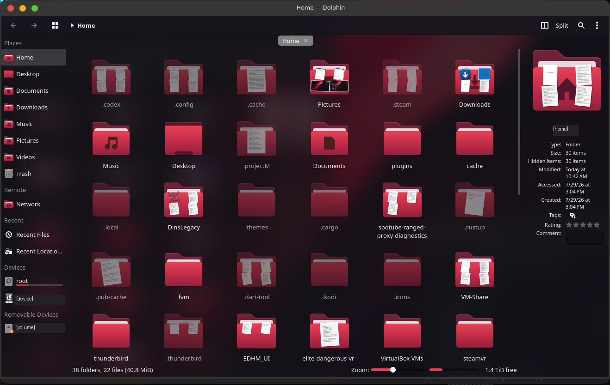

## Global File/Edit menu

Detail crop showing the active application menus in the top panel.

## Complete Crimson Glass icons

Rendered icon reference sheet showing application art, folders, devices, and file types; this is an asset sheet, not a desktop screenshot.

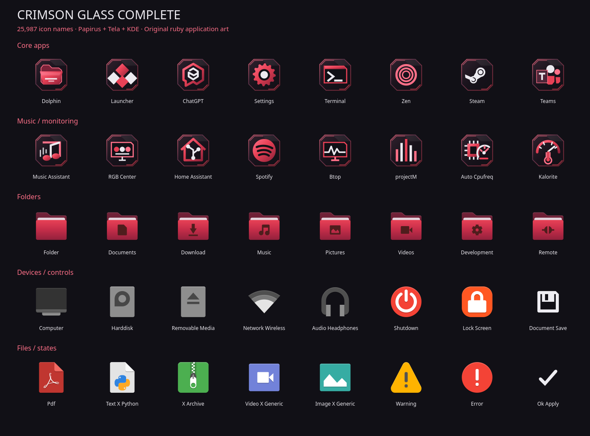

## Qt 6 and Kvantum

Actual Qt 6 theme-test window, cropped to exclude the background conversation.

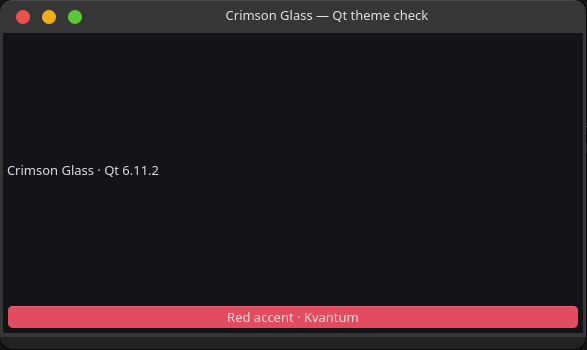

## Qt 5 and Kvantum

Actual Qt 5 theme-test window, cropped to exclude the background conversation.

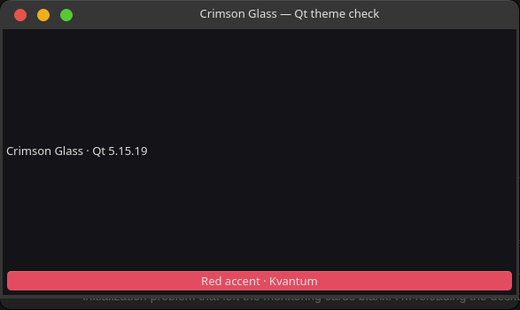

## GTK 3

Actual GTK 3 theme-test window. Faint text behind the transparent window is from the theme-build conversation.

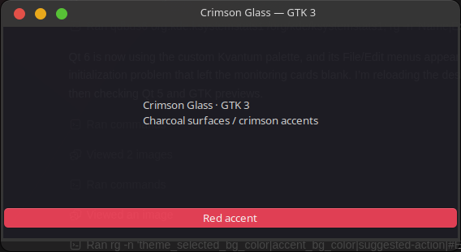

## GTK 4

Actual GTK 4 theme-test window. Faint text behind the transparent window is from the theme-build conversation.

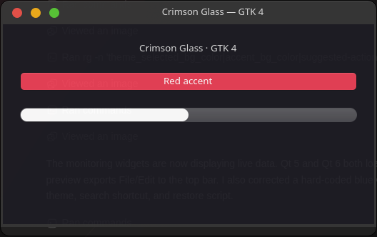

## SDDM login screen

Login theme preview captured in test mode; the account name is covered. The displayed session is from the test environment.

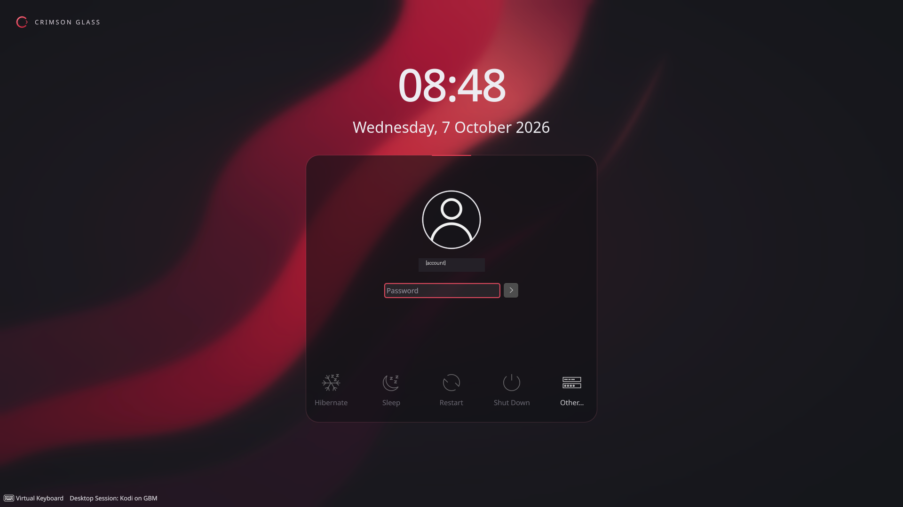

## Plasma splash screen

Captured Plasma splash preview with the Crimson Glass logo and progress indicator.

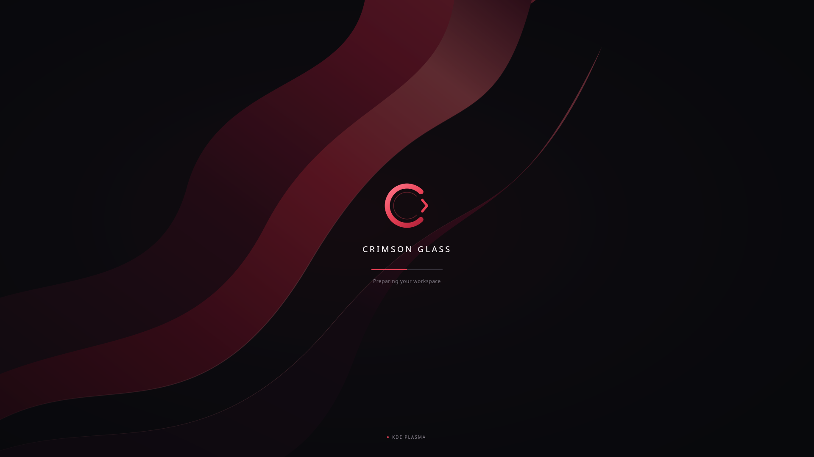

## Plymouth boot screen

Rendered boot-layout preview; this was not captured during an actual reboot.

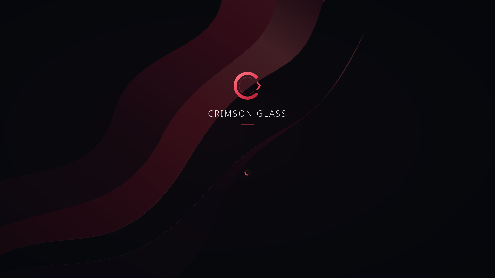

## Boot password prompt

Rendered Plymouth password-layout preview; no password is shown.

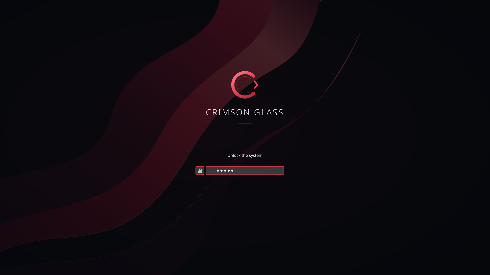

## Boot updates screen

Rendered Plymouth update-layout preview.

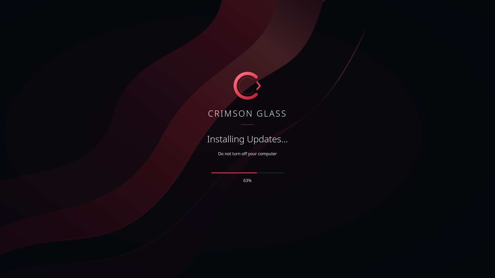

## Launcher and floating dock

The release includes the Andromeda launcher and floating dock. Available build captures of these still show the superseded Mac-style icons, so they are omitted to avoid misrepresenting the current package. Fresh launcher/dock captures remain to be added.
